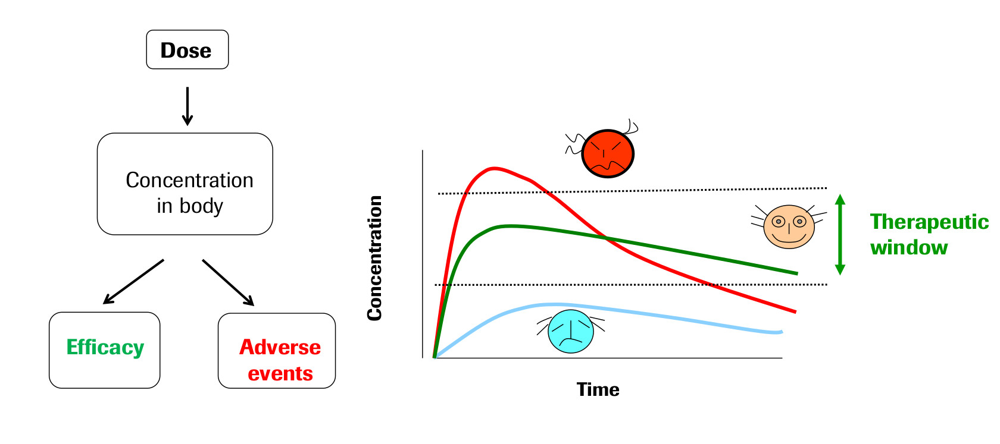

.. pkmodel documentation master file, created by
   sphinx-quickstart on Wed Oct 18 23:16:24 2023.
   You can adapt this file completely to your liking, but it should at least
   contain the root `toctree` directive.

Authors
===================================

J. Giblin-Burnham, C. Hamiltion, C. Chung, F. Rivetti 

Introduction
===================================

This is a Python package for the analysis PharmacoKinetic (PK) models of an injected solute dynamics over time. 
The code enables users to create models with custom parameters and find and plot the solutions. Users have the ability 
to plot multiple models together, and so compare them. Or plot the models separately for a more detailed and specific 
visualisation of a PK model. 

The field of Pharmacokinetics (PK) provides a quantitative basis for describing the delivery of a drug to a patient, 
the diffusion of that drug through the plasma/body tissue, and the subsequent clearance of the drug from the patient's 
system. PK is used to ensure that there is sufficient concentration of the drug to maintain the required efficacy of the 
drug, while ensuring that the concentration levels remain below the toxic threshold (See Fig 1). Pharmacokinetic (PK) models 
are often combined with Pharmacodynamic (PD) models, which model the positive effects of the drug, such as the binding of a 
drug to the biological target, and/or undesirable side effects, to form a full PKPD model of the drug-body interaction. 
This project will only focus on PK, neglecting the interaction with a PD model.

PK enables the following processes to be quantified:

* Absorption
* Distribution
* Metabolism
* Excretion

.. toctree::
   :maxdepth: 4
   :caption: Model Overview

   model_overview

.. toctree::
   :maxdepth: 4
   :caption: Setting up models

   Installation

.. toctree::
   :maxdepth: 4
   :caption: Documentation

   pkmodel

Indices and tables
==================

* :ref:`genindex`
* :ref:`modindex`
* :ref:`search`

